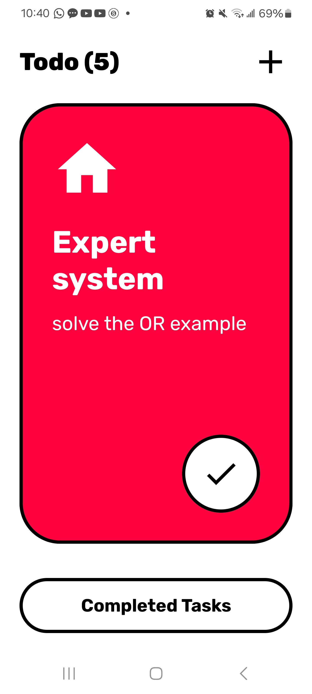
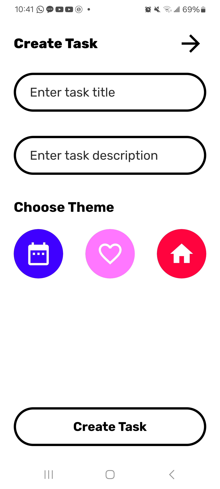
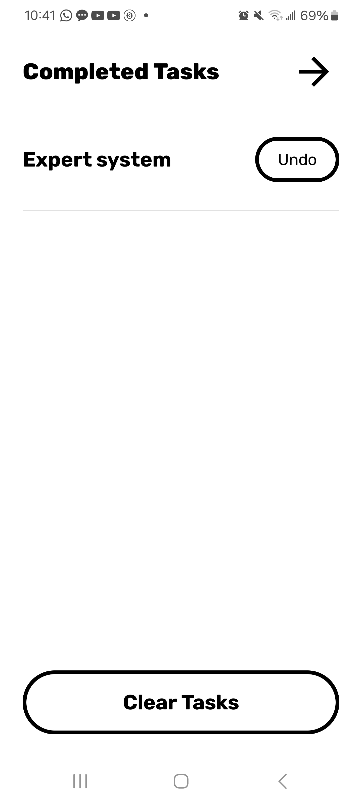

# Mobile-Apps-Dev
Android - Jetpack compose project ( Todo )

# 🚀 Todo App - Your Epic Task Manager! 📝

Welcome to the **Todo App**, the ultimate task management solution designed with **Jetpack Compose**! Whether you're juggling daily chores or planning your next big project, this app is here to make your life easier, faster, and more organized. 🌟

## 🎉 Key Features

- **Super Fast Performance** ⚡: Experience lightning-speed responsiveness as you add, edit, and manage your tasks. No more lag—just smooth sailing!
- **User-Friendly Interface** 🖥️: Our clean and intuitive design ensures that you can navigate through your tasks effortlessly. Say goodbye to clutter and hello to productivity!
- **Daily Life Made Easy** 🌈: Perfect for managing your everyday tasks, our app is tailored to fit seamlessly into your routine.
- **Dark Theme Support** 🌙: Switch to dark mode for a comfortable viewing experience at night or in low-light environments. Your eyes will thank you!
- **Task Organization** 📂: Easily categorize your tasks. Keep everything sorted and find what you need in a snap!

## 📸 App Screenshots

Here’s a sneak peek of the beautiful UI:


*Home Screen - Your task overview!*


*Add Task - Easily create new tasks!*


*Completed Tasks - Celebrate your achievements! 🎉*

## 🛠️ Tech Stack

This app is built using:

- **Jetpack Compose**: The modern toolkit for building native Android UIs! 🎨
- **Kotlin**: The powerful programming language for Android development. 🛠️
- **Coroutines**: For smooth asynchronous programming, ensuring that your app remains responsive. ⚡

## 🚀 Getting Started

Want to get this app running on your own device? Just follow these simple steps:

1. **Clone the Repository**:
   ```bash
   git clone https://github.com/yourusername/todo-app.git

## License

This repository is licensed under the Private Use License. It is intended for private use only. Please refer to the [LICENSE.md](LICENSE.md) file for details.
